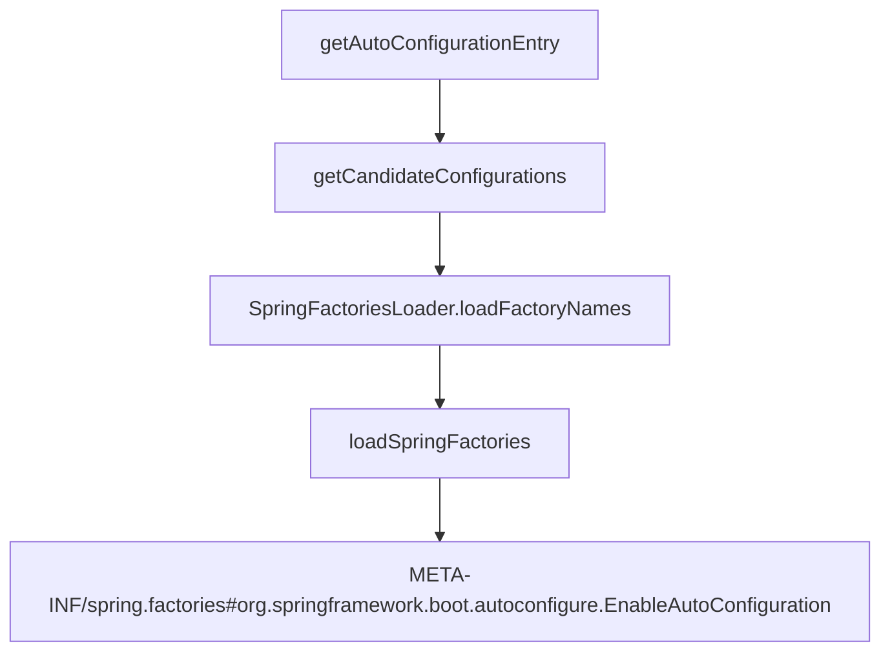

## 

### @EnableAutoConfiguration

* AutoConfigurationPackage

{:.rounded}

### @AutoConfigurationPackage

自动配置包

{:.rounded}

`new PackageImports(metadata).getPackageNames()`获取注解应用的类所在包路径。例如注解在`org.lei.server.StudyApplication`类, 将获取`org.lei.server`路径。利用`register`导入一系列组件。

### @Import(AutoConfigurationImportSelector.class)

{:.rounded}

* 利用`getAutoConfigurationEntry`函数给容器批量导入一些组件

{:.rounded}

{:.rounded}

`org.springframework.boot.autoconfigure.EnableAutoConfiguration`

* `getAutoConfigurationEntry` -> `getCandidateConfigurations` -> ``
