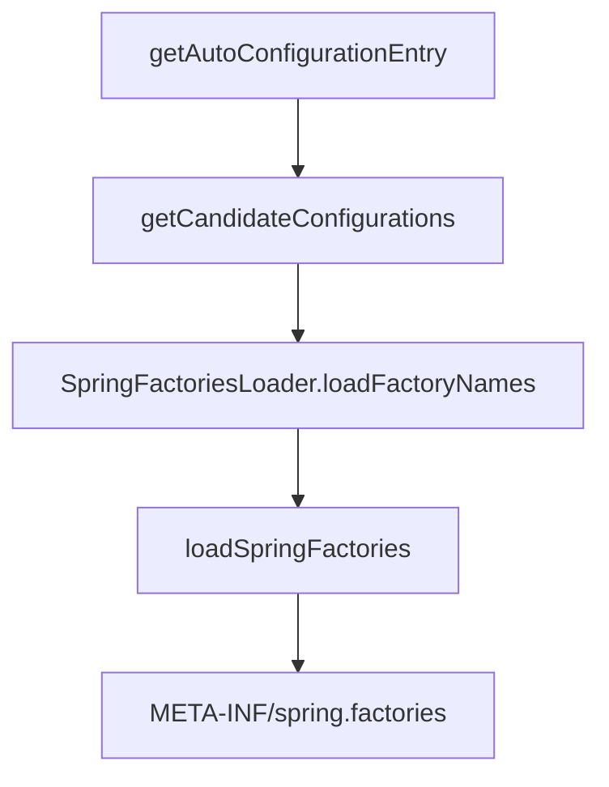

## 解析自动配置

### @EnableAutoConfiguration

{:.rounded}

#### @AutoConfigurationPackage

自动配置包

{:.rounded}

`new PackageImports(metadata).getPackageNames()`{:.info}获取注解应用的类所在包路径。

**例如:**

注解在`org.lei.server.StudyApplication`类, 将获取`org.lei.server`路径。利用`register`导入一系列组件。

#### @Import(AutoConfigurationImportSelector.class)

查看`selectImports`{:.info}函数

{:.rounded}



{:.rounded}

```java
public static final String FACTORIES_RESOURCE_LOCATION = "META-INF/spring.factories";
```

* 获取所有存在`META-INF/spring.factories`文件的路径

* 通过`PropertiesLoaderUtils.loadProperties`加载存在的路径, 获取`org.springframework.boot.autoconfigure.EnableAutoConfiguration`自动配置类

## 自定自动配置
